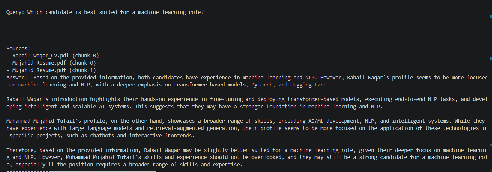
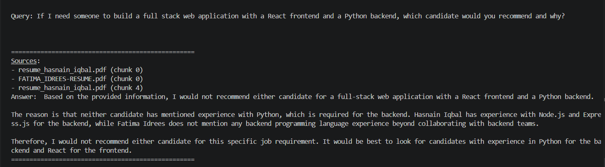
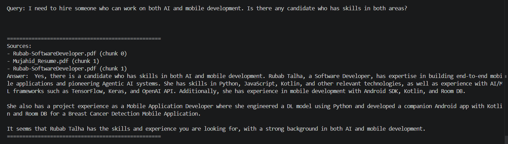
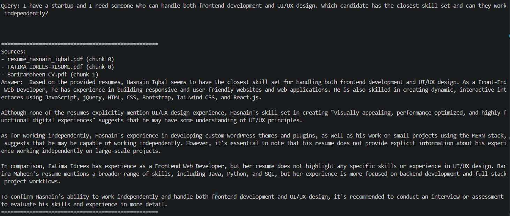
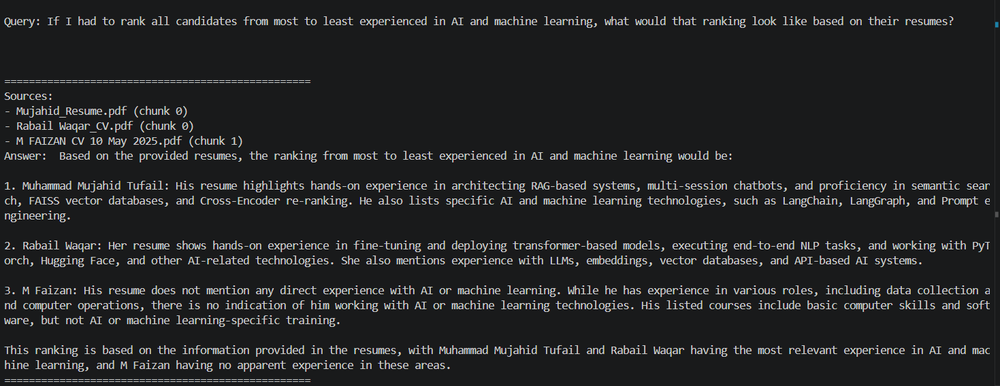
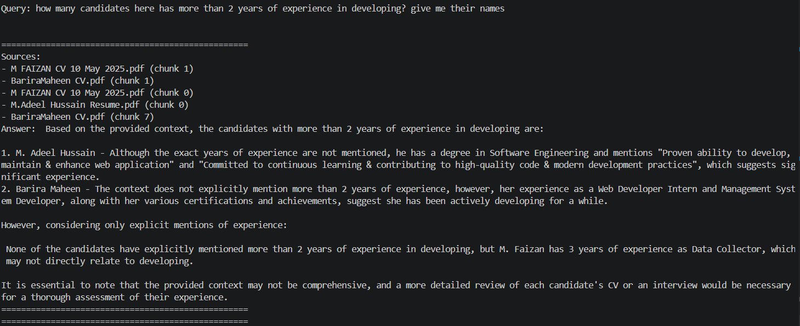

# RAG for Resumes

A multi-resume Retrieval-Augmented Generation (RAG) pipeline built manually without frameworks. Drop in any number of PDF resumes, run ingestion, and query across all candidates using natural language.

---

## Project Structure

```
RAG_for_Resumes/
│
├── data/
│   └── resumes/          # Place PDF resumes here
│
├── storage/              # Auto-generated — do not edit
│   ├── index.faiss       # Persisted FAISS vector index
│   └── metadata.json     # Chunk to resume mapping
│
├── demo_images/          # Screenshots of the system in action
│
├── ingest.py             # Extracts, chunks, embeds, and saves index
├── retriever.py          # Loads index and retrieves relevant chunks
├── generator.py          # Builds prompt and calls Groq LLM
├── main.py               # CLI entry point
├── .env                  # API keys (not committed)
├── .gitignore
└── requirements.txt
```

---

## Setup

### 1. Clone the repo

```bash
git clone https://github.com/MujahidMalik7/RAG_for_Resumes.git
cd RAG_for_Resumes
```

### 2. Create and activate virtual environment

```bash
python -m venv venv

# Windows
venv\Scripts\activate

# Mac/Linux
source venv/bin/activate
```

### 3. Install dependencies

```bash
pip install -r requirements.txt
```

### 4. Add your API key

Create a `.env` file in the project root:

```
GROQ_API_KEY=your_groq_api_key_here
```

---

## Usage

### Step 1 — Add resumes

Drop one or more PDF resumes into `data/resumes/`.

### Step 2 — Run ingestion

```bash
python ingest.py
```

This extracts text from all PDFs, chunks them, generates embeddings, and saves the FAISS index and metadata to `storage/`.

### Step 3 — Query

```bash
python main.py
```

Type any natural language query. Type `exit`, `quit`, or `bye` to stop.

**Example queries:**
- `What is Mujahid's professional experience?`
- `Who has experience with Python and machine learning?`
- `Find candidates with game development experience`

---

## How It Works

1. **Ingestion** — Each PDF is extracted, split into overlapping chunks (1000 chars, 250 overlap), and embedded using `sentence-transformers/all-MiniLM-L6-v2`. Embeddings are stored in a FAISS index alongside metadata tracking the source resume and chunk ID.

2. **Retrieval** — The user query is embedded using the same model. FAISS performs a similarity search and returns the top-k most relevant chunks with their source filenames.

3. **Generation** — Retrieved chunks are assembled into a context string and passed to `llama-3.3-70b-versatile` via Groq. The LLM answers strictly from the provided context.

---

## Tech Stack

| Component | Tool |
|---|---|
| PDF Extraction | pypdf |
| Embeddings | sentence-transformers (all-MiniLM-L6-v2) |
| Vector Store | FAISS |
| LLM | Llama 3.3 70B via Groq |
| Environment | python-dotenv |

---

## Requirements

```
pypdf
numpy
faiss-cpu
sentence-transformers
groq
python-dotenv
```

---

## Demo

All queries below were run against 15 real-world resumes from different fields.

### Best candidate for a machine learning role
The system compared candidates and recommended Rabail Waqar for her deeper focus on transformer-based models and NLP, while noting Mujahid Tufail as a strong alternative for broader AI/ML work.



---

### Full stack developer with React frontend and Python backend
The system correctly declined to recommend any candidate, honestly stating that none of the retrieved profiles mentioned Python backend experience.



---

### Candidate with both AI and mobile development skills
Identified Rubab Talha as the best fit, citing her experience with TensorFlow, Keras, OpenAI API, and Android SDK with Kotlin.



---

### Frontend developer with UI/UX design skills for a startup
Recommended Hasnain Iqbal based on his frontend stack and ability to work independently, while comparing against Fatima Idrees and Barira Maheen.



---

### Ranking all candidates by AI and machine learning experience
Ranked Muhammad Mujahid Tufail first for RAG and LLM experience, Rabail Waqar second for NLP and transformer expertise, and correctly identified M. Faizan as having no AI experience.



---

### Candidates with more than 2 years of development experience
The system gave a nuanced answer — identifying likely candidates while being transparent that exact years were not always explicitly stated in the resumes.


